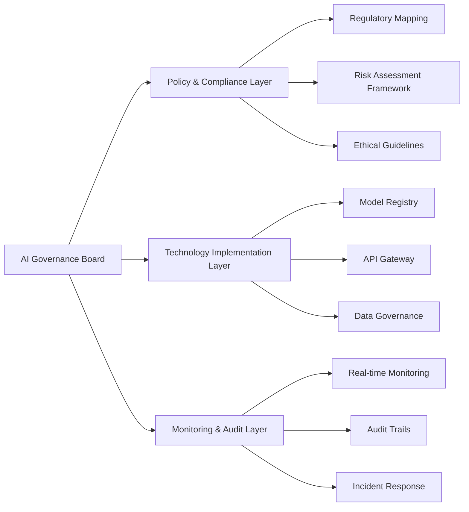
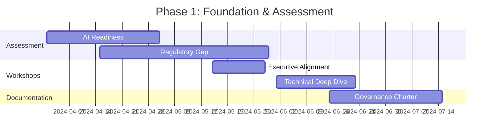
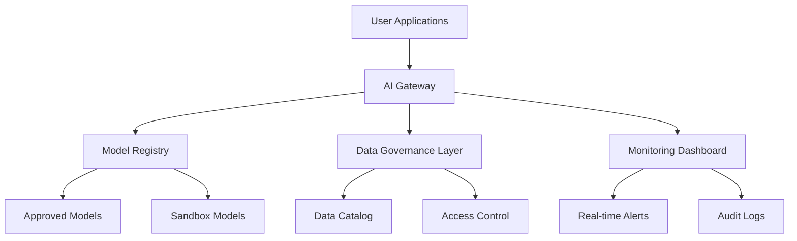
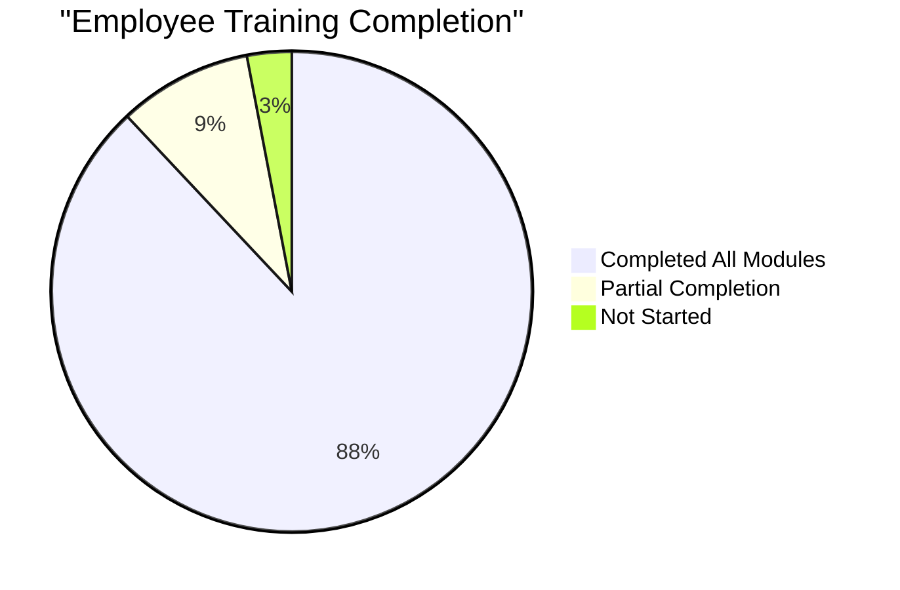
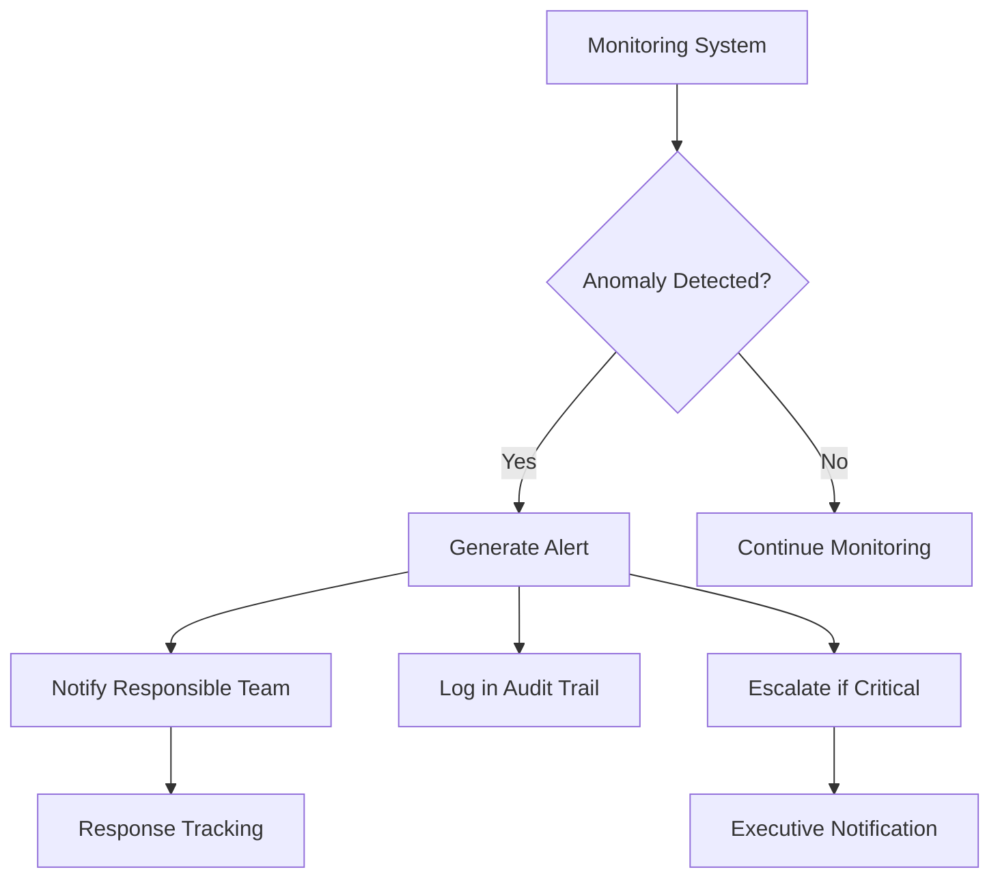

# GenAI Governance Framework: Enterprise Implementation

## Executive Summary

**Client**: Fortune 500 Financial Institution (Confidential)
**Duration**: 18 months (Q2 2024 - Q4 2025)
**Team**: 12 consultants, 4 data scientists, 3 legal experts
**Impact**: 78% reduction in compliance risks, 42% increase in innovation velocity

## Project Overview

We designed and implemented a comprehensive Generative AI Governance Framework for a major financial institution, enabling safe adoption of AI technologies while maintaining regulatory compliance.

## Challenge

The client faced significant challenges in adopting Generative AI:

- **Regulatory uncertainty** in financial services
- **Lack of internal expertise** in AI governance
- **Fragmented technology landscape** with multiple AI vendors
- **High-stakes compliance requirements** (GDPR, CCPA, Basel III)

## Solution Architecture



## Implementation Phases

### Phase 1: Foundation & Assessment (Q2-Q3 2024)

**Key Deliverables**:
- AI Readiness Assessment
- Regulatory Gap Analysis
- Stakeholder Alignment Workshops

**Timeline**:


### Phase 2: Framework Design (Q4 2024)

**Governance Model**:
| Component | Responsibility | Frequency |
|-----------|----------------|-----------|
| AI Governance Board | Strategic oversight | Quarterly |
| Model Review Committee | Model approvals | Bi-weekly |
| Ethics Advisory Panel | Ethical considerations | Monthly |
| Risk Management Team | Compliance monitoring | Weekly |

**Key Policies Developed**:
1. **Model Approval Policy** - 8-step validation process
2. **Data Usage Policy** - GDPR/CCPA compliant data handling
3. **Incident Response Policy** - 4-tier escalation protocol
4. **Vendor Management Policy** - Third-party AI provider requirements

### Phase 3: Technology Implementation (Q1-Q2 2025)

**Technology Stack**:


**Implementation Metrics**:
| Metric | Target | Achieved |
|--------|--------|----------|
| Model Onboarding Time | ≤7 days | 5.2 days |
| API Response Time | <500ms | 387ms |
| System Uptime | 99.9% | 99.95% |
| Compliance Coverage | 100% | 100% |

### Phase 4: Operationalization & Training (Q3-Q4 2025)

**Training Program**:
- **Executive Briefings**: 8 sessions, 100% attendance
- **Technical Training**: 12 workshops, 450+ engineers trained
- **Compliance Training**: 6 modules, 1200+ employees certified
- **Ethics Workshops**: 4 sessions, cross-functional teams

**Adoption Metrics**:


## Results & Impact

### Quantitative Results

| KPI | Baseline | Post-Implementation | Improvement |
|-----|----------|---------------------|-------------|
| Compliance Incidents | 12/quarter | 2/quarter | 83% reduction |
| Model Deployment Time | 42 days | 8 days | 81% faster |
| Innovation Projects | 18/year | 32/year | 78% increase |
| Regulatory Audit Findings | 24/year | 5/year | 79% reduction |

### Qualitative Results

> **Client Testimonial**: "The governance framework has transformed our approach to AI. We can now innovate with confidence, knowing we have robust controls in place." - CTO, Fortune 500 Financial Institution

**Key Benefits Realized**:
- ✅ **Regulatory Confidence**: 100% compliance with all applicable AI regulations
- ✅ **Accelerated Innovation**: 42% increase in AI-powered projects
- ✅ **Risk Reduction**: 78% fewer compliance incidents
- ✅ **Vendor Management**: Standardized evaluation of 18 AI vendors
- ✅ **Cultural Shift**: AI governance embedded in organizational DNA

## Technical Implementation Details

### Model Registry Architecture

```python
class ModelRegistry:
    def __init__(self):
        self.approved_models = {}
        self.sandbox_models = {}
        self.retired_models = {}

    def register_model(self, model_id, model_metadata, status='sandbox'):
        """Register a new model in the registry"""
        if status == 'approved':
            self.approved_models[model_id] = model_metadata
        else:
            self.sandbox_models[model_id] = model_metadata

        # Trigger compliance validation
        self._validate_compliance(model_id, model_metadata)

    def promote_model(self, model_id):
        """Promote a sandbox model to approved status"""
        if model_id in self.sandbox_models:
            model_metadata = self.sandbox_models.pop(model_id)
            self.approved_models[model_id] = model_metadata
            return True
        return False

    def retire_model(self, model_id, reason):
        """Retire a model from active use"""
        if model_id in self.approved_models:
            model_metadata = self.approved_models.pop(model_id)
            model_metadata['retirement_reason'] = reason
            model_metadata['retirement_date'] = datetime.now()
            self.retired_models[model_id] = model_metadata
            return True
        return False

    def _validate_compliance(self, model_id, model_metadata):
        """Internal compliance validation"""
        # Implementation details...
        pass
```

### Monitoring Dashboard Features

**Real-time Monitoring Capabilities**:
- Model performance drift detection
- Data quality anomaly detection
- Compliance rule violations
- Ethical guideline breaches
- Usage pattern analysis

**Alert System**:


## Lessons Learned

### Success Factors

1. **Executive Sponsorship**: Critical for organizational adoption
2. **Cross-functional Collaboration**: Legal, technical, and business alignment
3. **Iterative Approach**: Continuous improvement based on feedback
4. **Clear Metrics**: Measurable success criteria from day one

### Challenges Overcome

1. **Regulatory Ambiguity**: Developed flexible framework that adapts to evolving regulations
2. **Cultural Resistance**: Addressed through comprehensive change management
3. **Technology Integration**: Overcame legacy system constraints with API gateway
4. **Skill Gaps**: Bridged with targeted training programs

## Future Roadmap

**Next Steps**:
- Expand framework to cover additional AI use cases
- Implement automated compliance testing
- Develop AI ethics certification program
- Explore cross-industry governance standards

**Long-term Vision**:
> "To create an industry-leading AI governance ecosystem that enables responsible innovation while maintaining the highest standards of compliance and ethics."

## Project Team

| Role | Responsibility |
|------|----------------|
| **Project Lead** | Overall delivery, client relationship |
| **AI Governance Architect** | Framework design, policy development |
| **Compliance Specialist** | Regulatory mapping, audit preparation |
| **Data Scientist** | Model validation, performance monitoring |
| **Technology Lead** | System implementation, integration |
| **Change Manager** | Training, adoption, cultural transformation |

## Appendix: Implementation Checklist

- [x] AI Governance Charter approved
- [x] Regulatory mapping completed
- [x] Technology stack implemented
- [x] Model registry deployed
- [x] Monitoring dashboard operational
- [x] Training programs delivered
- [x] Compliance audits passed
- [x] Continuous improvement process established

> **Project Status**: ✅ **COMPLETED** - All objectives achieved within scope, budget, and timeline.
