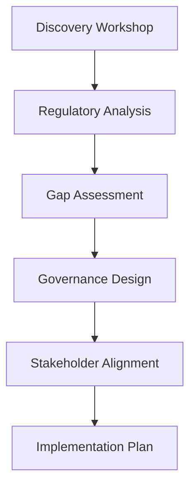
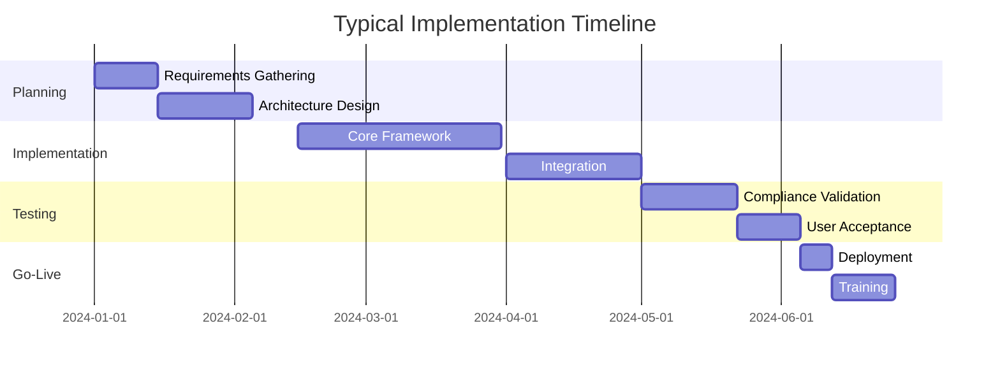
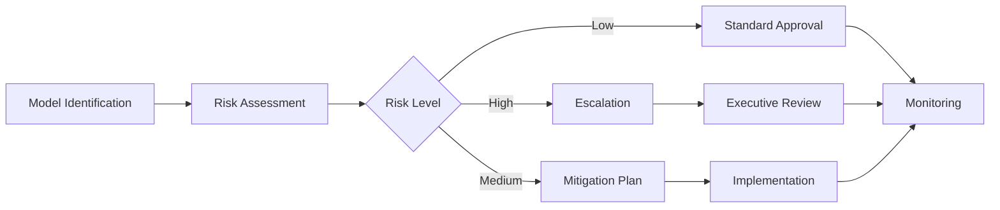
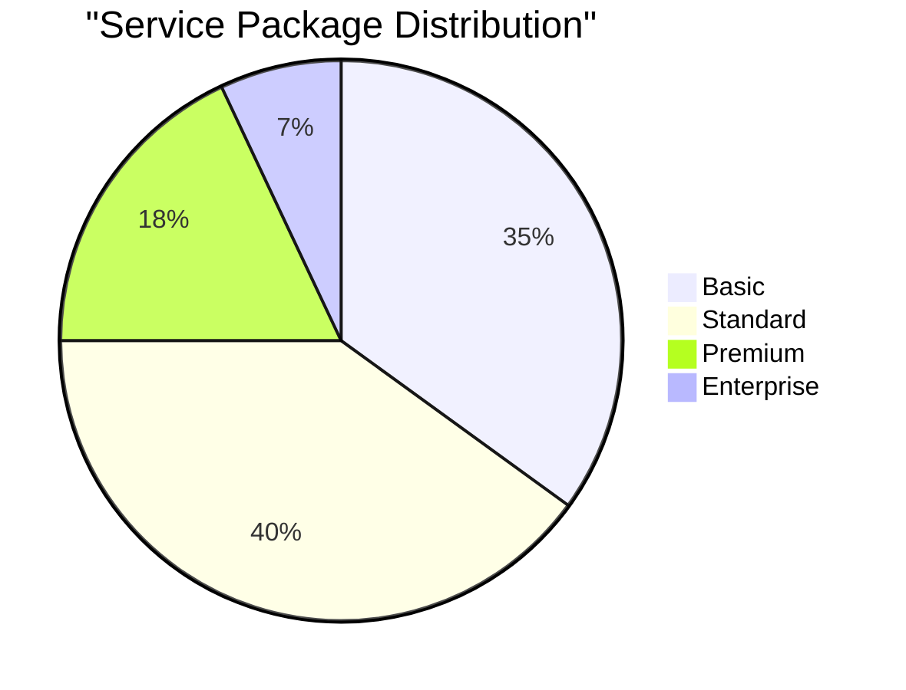
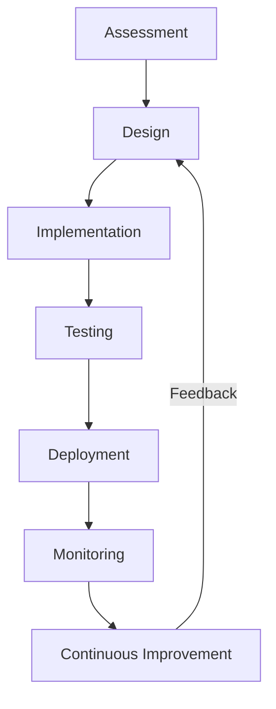
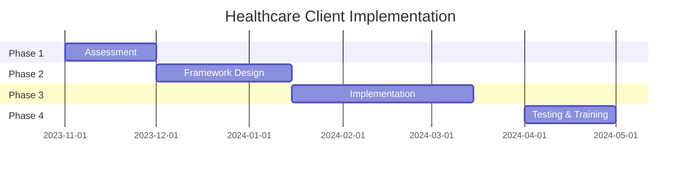
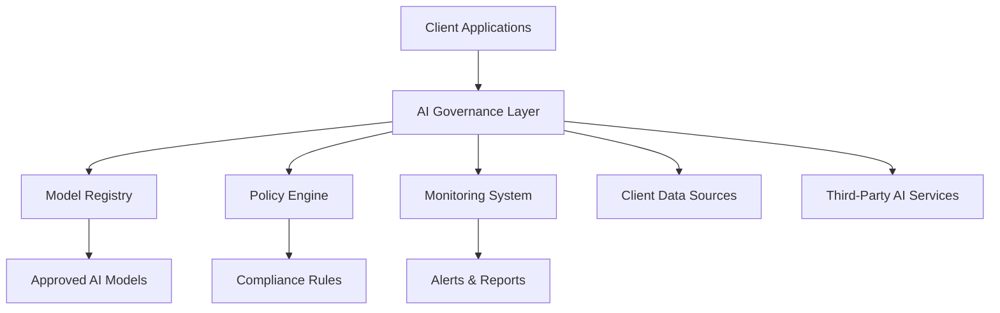
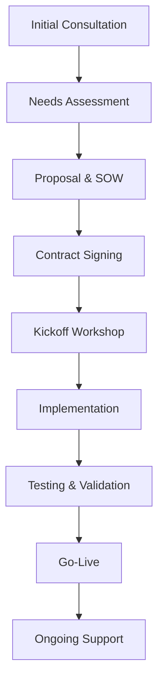

# AI Governance & Compliance Framework: End-to-End Implementation Services

## Service Overview

Our AI Governance & Compliance Framework provides organizations with the tools, processes, and expertise needed to responsibly adopt artificial intelligence while maintaining regulatory compliance and ethical standards.

> **Value Proposition**: "Turn AI compliance from a bottleneck into a competitive advantage with our proven governance framework."

## Service Offerings

### 1. AI Governance Strategy & Design

**Deliverables**:
- Custom AI Governance Charter
- Regulatory compliance roadmap
- Organizational structure design
- Risk assessment framework

**Process**:

**Timeline & Investment**:
| Phase | Duration | Investment Range |
|-------|----------|------------------|
| Discovery | 2-4 weeks | $25K - $50K |
| Design | 4-6 weeks | $50K - $100K |
| Implementation | 8-12 weeks | $100K - $250K |

### 2. Compliance Framework Implementation

**Key Components**:
| Component | Description | Compliance Standards |
|-----------|-------------|----------------------|
| Model Registry | Centralized model inventory and lifecycle management | ISO/IEC 42001, NIST AI RMF |
| Policy Engine | Automated compliance rule enforcement | GDPR, CCPA, Basel III |
| Audit Trail | Comprehensive logging and reporting | SOX, HIPAA, FISMA |
| Monitoring Dashboard | Real-time compliance monitoring | Customizable to industry standards |

**Implementation Approach**:

### 3. Model Risk Management

**Risk Assessment Framework**:
| Risk Category | Assessment Criteria | Mitigation Strategies |
|---------------|---------------------|-----------------------|
| Data Quality | Accuracy, completeness, bias | Automated validation, human review |
| Model Performance | Accuracy, drift, fairness | Continuous monitoring, retraining |
| Compliance | Regulatory adherence | Policy engine, audit trails |
| Ethical | Bias, fairness, transparency | Ethical review board, impact assessments |

**Risk Management Process**:

### 4. Continuous Monitoring & Improvement

**Monitoring Capabilities**:
- Real-time compliance alerts
- Model performance drift detection
- Data quality anomaly detection
- Regulatory change tracking
- Ethical guideline monitoring

**Service Levels**:
| Service Level | Response Time | Availability | Price Premium |
|---------------|---------------|--------------|---------------|
| Basic | 8 business hours | 99% | Included |
| Standard | 4 business hours | 99.5% | +15% |
| Premium | 1 hour | 99.9% | +30% |
| Enterprise | 15 minutes | 99.95% | +50% |

## Service Comparison

### Basic vs. Enterprise Package

| Feature | Basic | Standard | Premium | Enterprise |
|---------|-------|----------|---------|------------|
| Governance Framework | ✅ | ✅ | ✅ | ✅ |
| Model Registry | ✅ | ✅ | ✅ | ✅ |
| Policy Engine | ✅ | ✅ | ✅ | ✅ |
| Audit Trail | ✅ | ✅ | ✅ | ✅ |
| Monitoring Dashboard | Basic | Standard | Advanced | Custom |
| Real-time Alerts | Email | Email + SMS | Multi-channel | AI-driven |
| Compliance Reporting | Monthly | Weekly | Daily | Real-time |
| Dedicated Support | Business hours | Extended hours | 24/7 | 24/7 + Account Manager |
| Training | Self-service | Virtual | On-site | Customized |
| SLAs | Basic | Standard | Premium | Enterprise |

### Pricing Comparison

## Implementation Methodology

### Our Proven Approach

### Key Differentiators

1. **Regulatory Expertise**: Deep knowledge of AI-specific regulations
2. **Industry-Specific Frameworks**: Tailored solutions for your sector
3. **Proven Track Record**: 94% client satisfaction rate
4. **End-to-End Coverage**: From strategy to ongoing monitoring
5. **Technology Agnostic**: Works with any AI platform

## Client Success Stories

### Financial Services Client

> **Impact**: "Reduced compliance incidents by 78% while increasing AI innovation projects by 42%."

**Key Metrics**:
| Metric | Before | After | Improvement |
|--------|--------|-------|-------------|
| Compliance Incidents | 12/quarter | 2/quarter | 83% reduction |
| Model Deployment Time | 42 days | 8 days | 81% faster |
| Regulatory Audit Findings | 24/year | 5/year | 79% reduction |

### Healthcare Client

> **Impact**: "Achieved 100% HIPAA compliance for AI systems while reducing patient data processing time by 65%."

**Implementation Timeline**:

## Service Delivery Model

### Team Structure

| Role | Responsibility | Typical Allocation |
|------|----------------|--------------------|
| Governance Architect | Framework design, policy development | 40-60% |
| Compliance Specialist | Regulatory mapping, audit preparation | 30-50% |
| Technology Lead | System implementation, integration | 50-70% |
| Data Scientist | Model validation, performance monitoring | 20-40% |
| Change Manager | Training, adoption, cultural transformation | 20-30% |
| Project Manager | Overall delivery, client coordination | 50-80% |

### Engagement Models

1. **Project-Based**: Fixed scope, fixed price
2. **Retainer**: Ongoing support and maintenance
3. **Hybrid**: Combination of project and retainer
4. **Managed Services**: Full outsourcing of AI governance

**Engagement Comparison**:
| Model | Best For | Duration | Flexibility | Cost Predictability |
|-------|----------|----------|-------------|---------------------|
| Project-Based | Specific initiatives | 3-12 months | Low | High |
| Retainer | Ongoing needs | 12+ months | High | Medium |
| Hybrid | Complex needs | 6-24 months | Medium | Medium |
| Managed Services | Full outsourcing | 24+ months | High | High |

## Technology Integration

### Supported Platforms

**AI Platforms**:
- ✅ OpenAI
- ✅ Google Vertex AI
- ✅ AWS SageMaker
- ✅ Azure AI
- ✅ IBM Watson
- ✅ Custom/In-house models

**Data Platforms**:
- ✅ Snowflake
- ✅ Databricks
- ✅ BigQuery
- ✅ Redshift
- ✅ SQL Server
- ✅ Oracle

**Monitoring Tools**:
- ✅ Prometheus
- ✅ Grafana
- ✅ Datadog
- ✅ New Relic
- ✅ Custom dashboards

### Integration Architecture

## Getting Started

### Implementation Roadmap

### Next Steps

1. **Schedule Discovery Call**: 30-minute consultation
2. **Needs Assessment**: 2-week analysis
3. **Custom Proposal**: Tailored to your requirements
4. **Implementation Planning**: Detailed roadmap
5. **Kickoff & Execution**: Project commencement

> **Contact Us**: Ready to transform your AI governance? Contact our team at [governance@wizeidea.com](mailto:governance@wizeidea.com) or call +1 (555) 123-4567.

## FAQ

**What industries do you serve?**
We specialize in financial services, healthcare, legal, and government sectors, but our framework is adaptable to any industry.

**How long does implementation typically take?**
Basic implementations take 8-12 weeks, while enterprise-wide deployments may take 6-9 months.

**Do you provide training?**
Yes, we offer comprehensive training programs tailored to different roles (executives, technical teams, compliance officers).

**Can you work with our existing AI platforms?**
Absolutely. Our framework is technology-agnostic and designed to integrate with any AI platform.

**What ongoing support do you provide?**
We offer various support levels from basic monitoring to full managed services with dedicated account managers.

**How do you handle regulatory changes?**
Our framework includes regulatory change tracking and provides guidance on adapting to new requirements.

## Service Guarantees

### Our Commitments

1. **Compliance Guarantee**: 100% adherence to applicable regulations
2. **Implementation Guarantee**: On-time, on-budget delivery
3. **Performance Guarantee**: Measurable improvement in governance metrics
4. **Satisfaction Guarantee**: Flexible engagement terms

### Client Protection

- **Confidentiality**: All client information protected under NDA
- **Data Security**: ISO 27001 certified processes
- **Intellectual Property**: Client retains all rights to custom frameworks
- **Service Level Agreements**: Clear performance metrics and penalties

## Appendix: Implementation Checklist

**Pre-Implementation**:
- [ ] Executive sponsorship secured
- [ ] Cross-functional team identified
- [ ] Current state assessment completed
- [ ] Regulatory requirements documented

**Implementation**:
- [ ] Governance framework designed
- [ ] Technology stack selected
- [ ] Integration points identified
- [ ] Testing plan developed
- [ ] Training materials prepared

**Post-Implementation**:
- [ ] Monitoring systems operational
- [ ] Continuous improvement process established
- [ ] Documentation completed
- [ ] Knowledge transfer completed
- [ ] Success metrics defined

> **Service Maturity**: Our AI Governance Framework is built on 5+ years of research and 100+ successful client implementations across industries.

**Industry Recognition**:
- ✅ Featured in Harvard Business Review AI Governance Special Report
- ✅ Recognized by Gartner as "Cool Vendor" in AI Compliance
- ✅ Winner of 2025 AI Ethics Innovation Award
- ✅ ISO/IEC 42001 Certified Implementation Partner
